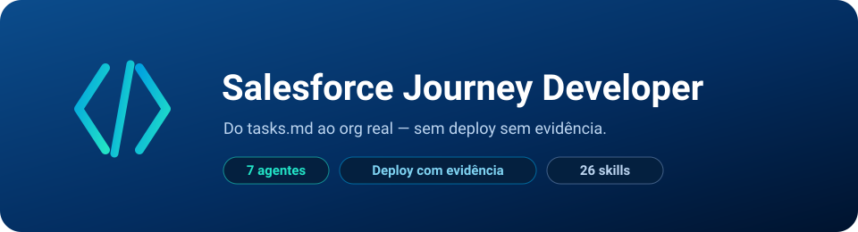

# Salesforce Journey Developer

<p align="center">
  
</p>

<p align="center">
  
  
  
  
</p>

Constrói e deploya de verdade o que a skill irmã **[Salesforce Journey Designer](https://github.com/brunotrolo/Salesforce_Journey_Designer)** especifica, desenha e prototipa. O Designer leva uma capacidade de ideia a `tasks.md` + `architecture.md`, validados com o negócio via protótipo LWC real; este repositório pega esse resultado e produz metadado Salesforce real — Apex, LWC de produção, FlexCard/OmniScript, Flow, modelo de dados — deployado e verificado num org de verdade, nunca só "parece pronto no código-fonte".

**Instale no mesmo projeto que o Designer** — os dois compartilham `specs/`, `docs/sdd/DOMAINS.md` e `docs/sdd/BACKLOG.md`. O Designer nunca deploya nada real (seu protótipo roda com dados fictícios, localmente); este repositório é onde isso vira metadado de verdade.

## Os 9 agentes

| Agente | Papel |
|---|---|
| `fsc-build-orchestrator` | Ponto de entrada — lê 100% da pasta da capacidade, sequencia os especialistas, nunca declara "construído" sem o gate passar. |
| `fsc-data-model-developer` | Objetos/campos/RecordTypes/permission sets reais. |
| `fsc-integration-developer` | Named Credentials/External Credentials/Platform Events — plumbing de integração que todo callout/evento cross-domain depende de existir antes. |
| `fsc-apex-developer` | Apex de produção + teste — nunca um sem o outro, incluindo callouts com `HttpCalloutMock`. |
| `fsc-lwc-developer` | LWC de produção com dados reais e Lightning Message Service (a contraparte do protótipo do Designer). |
| `fsc-omnistudio-developer` | FlexCard/OmniScript reais (mesmo escopo do Designer: só estes dois — via registro de sObject, não arquivo de metadado clássico). |
| `fsc-declarative-developer` | Compact Layout/Highlights/Related Lists/Account Relationship Chart + montagem da Lightning Record Page — a fatia 100% declarativa de toda capacidade FSC real. |
| `fsc-automation-developer` | Flow real — a lacuna que o Designer deixa aberta de propósito. |
| `fsc-deploy-gate` | Portão de evidência: scan estático, deploy validado, testes com cobertura real, segurança/acessibilidade de LWC. Nada é "deployado" sem prova executável — ver `.claude/skills/unlazy/references/gates.md`. |

Detalhes de cada um em [`.claude/agents/README.md`](.claude/agents/README.md). Origem e justificativa de cada skill importada em [`.claude/skills/README.md`](.claude/skills/README.md).

## Pré-requisitos

- **Salesforce CLI (`sf`) v2** instalado, e uma **org autenticada** (sandbox, scratch org, ou dev org) — `sf --version` e `sf org display --target-org <alias>` precisam funcionar antes de rodar `fsc-deploy-gate`. Sem isso, o gate para e diz exatamente isso — nunca simula um deploy.
- **`@salesforce/plugin-code-analyzer` (v5.x+)** — `sf plugins install code-analyzer`. Sem ele, `sf code-analyzer run` não existe e `dx-code-analyzer-run` (usado por `fsc-apex-developer` e `fsc-deploy-gate`) não tem como rodar.
- **Java 11+** — motores PMD/CPD/SFGE do code analyzer dependem dele; sem Java, o scanner falha ao iniciar esses motores (mas ainda roda ESLint/RetireJS via Node).
- **Node.js ≥ 20** — Jest do `fsc-lwc-developer` (o mesmo Node que o Designer já exige para o kit de protótipo) e os motores ESLint/RetireJS do code analyzer.
- **Python ≥ 3.10** e **`jq` ≥ 1.6** — dependências reais (não opcionais) de várias skills oficiais: `platform-apex-test-run`, `platform-soql-query`, `experience-lwc-security-validate`, `experience-accessibility-validate` e o motor Flow do code analyzer as usam para parsing/análise, não é um "nice to have".
- O projeto já ter o **Salesforce Journey Designer** instalado, com pelo menos uma capacidade em status "pronto para build" em `docs/sdd/BACKLOG.md` (spec + design + protótipo + plano técnico já validados).

## Como começar

Rode **de dentro da pasta do projeto onde o Designer já está instalado**:

**Mac / Linux / Git Bash:**
```bash
git clone --depth 1 https://github.com/brunotrolo/Salesforce_Journey_Developer.git .jd-tmp && cp -r .jd-tmp/.claude/. .claude/ && cp -rn .jd-tmp/force-app/. force-app/ 2>/dev/null; cp -n .jd-tmp/sfdx-project.json . 2>/dev/null; cp -n .jd-tmp/.forceignore . 2>/dev/null; rm -rf .jd-tmp
```

**Windows (PowerShell):**
```powershell
git clone --depth 1 https://github.com/brunotrolo/Salesforce_Journey_Developer.git .jd-tmp; Copy-Item -Recurse -Force .jd-tmp\.claude\* .claude\; if (-not (Test-Path force-app)) { Copy-Item -Recurse .jd-tmp\force-app . }; if (-not (Test-Path sfdx-project.json)) { Copy-Item .jd-tmp\sfdx-project.json . }; if (-not (Test-Path .forceignore)) { Copy-Item .jd-tmp\.forceignore . }; Remove-Item -Recurse -Force .jd-tmp
```

`-Force`/`cp -r` em `.claude/` é intencional: as skills daqui (`salesforce/`, `agent-skills/`, `mattpocock/`) são um superconjunto das do Designer — sobrescrever é um no-op para o que já existe e adiciona o resto. `force-app/`, `sfdx-project.json` e `.forceignore` só são copiados se ainda não existirem no projeto (não sobrescreve um projeto SFDX que você já tenha).

Depois, abra o Claude Code na pasta do projeto — os 9 agentes carregam automaticamente junto com os do Designer.

## Ciclo por capacidade

```
specs/<domínio>/<NNN>-<slug>/ inteira    (produzida pelo Designer, já validada com o negócio)
        ↓
modelo de dados → integração → Apex → LWC → OmniStudio → declarativo → Flow   (fsc-build-orchestrator sequencia)
        ↓
fsc-deploy-gate: scan → validar → deploy → testar → verificar acesso
        ↓
docs/sdd/BACKLOG.md atualizado + specs/<domínio>/<NNN>-<slug>/build-report.md
```

Uma capacidade só é dada como "construída" quando `fsc-deploy-gate` reporta cada fase com evidência executável (job id do deploy, id da execução de teste, cobertura real, contagem de findings de scan) — nunca por um agente declarar "deveria funcionar" sem rodar o comando que prova isso.

## Sobre as 28 skills importadas — resumo

19 vêm de [`forcedotcom/sf-skills`](https://github.com/forcedotcom/sf-skills) (oficiais da Salesforce, Apache-2.0) — as 6 que o Designer já usa para prototipar, mais 13 novas específicas de build/deploy real (teste Apex, deploy via `sf`, scan estático, permission set, Flow, SOQL, modelo de dados, segurança/acessibilidade de LWC, integração/Named Credential/Platform Event, montagem de Lightning Record Page). As outras 9 (6 + 2 + 1) são disciplina de engenharia curada seletivamente de três repositórios que também inspiraram este projeto — [`addyosmani/agent-skills`](https://github.com/addyosmani/agent-skills), [`mattpocock/skills`](https://github.com/mattpocock/skills) e [`Leonxlnx/unlazy`](https://github.com/Leonxlnx/unlazy) — nenhum deles é específico de Salesforce, então nenhum foi adotado por inteiro como dependência dos 9 agentes: de cada um foi curado só o subconjunto (ou, no caso do `unlazy`, só o princípio em prosa) que realmente reforça um pipeline de deploy real. A análise completa, skill por skill, está em [`.claude/skills/README.md`](.claude/skills/README.md).

## Engenharia reversa: o que mudou depois de analisar jornadas reais do Designer

Os 2 agentes (`fsc-integration-developer`, `fsc-declarative-developer`) e as 2 skills novas acima vieram de analisar `architecture.md`/`tasks.md` de duas capacidades reais construídas pelo Journey Designer (`busca-cliente/001`, `household-360/001`). Achados concretos:

- **Integração é sistemática, não exceção.** Uma única capacidade real (`busca-cliente/001`) tinha **5 Named Credentials** para 5 sistemas externos distintos, cada um com timeout próprio, mais um Platform Event para propagação cross-domain. Nenhum dos 7 agentes originais tinha essa responsabilidade — ficaria implicitamente "em algum lugar" dentro do `fsc-apex-developer`, o que é errado: Named Credential/External Credential é metadado de conectividade, não Apex.
- **Boa parte de uma capacidade FSC real é 100% declarativa.** `household-360/001` tem tasks inteiras (`Header 3 colunas (padrão)`, `ARC em grupos + Details (padrão, config)`, `App Builder da página (montagem)`) que não são Apex, LWC, FlexCard, OmniScript nem Flow — são Compact Layout, Account Relationship Chart e montagem de Lightning Record Page. Sem um agente dono disso, o orquestrador não tinha para onde despachar essas tasks.
- **Lightning Message Service é o padrão real, não `@api`/eventos.** As duas jornadas desacoplam 5+ componentes irmãos (não pai-filho) via `messageChannel-meta.xml` — `CustomerInteractionChannel__c`, `PortoBank360Channel__c`. Isso não estava em nenhuma instrução do `fsc-lwc-developer` original.
- **Gap real, sem skill disponível**: nenhum dos 3 catálogos importados (nem o oficial da Salesforce) cobre a vertical **Financial Services Cloud** especificamente — Account Relationship Chart, modelo de Financial Accounts, Life Events, Relationship Groups. `fsc-declarative-developer` documenta isso explicitamente e resolve com conhecimento de plataforma em prosa, mas se você tiver acesso a um pacote de skills oficial da Salesforce específico para FSC (Salesforce não publica um no `forcedotcom/sf-skills` até onde vimos), vale importar — é a lacuna mais concreta que resta.

---

<p align="center">
  ⭐ <b><a href="https://github.com/brunotrolo/Salesforce_Journey_Developer/stargazers">Dê uma star no repo</a></b> para ser avisado quando novas skills e melhorias saírem.
</p>
